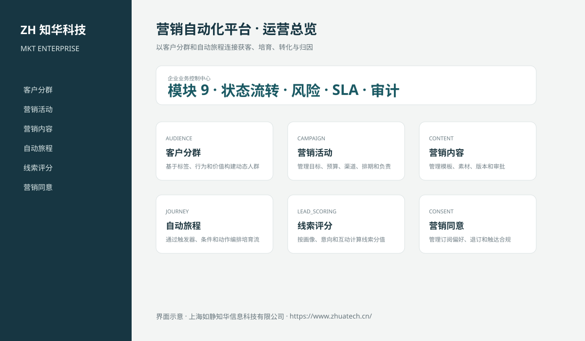

# ZhuaTech MKT｜营销自动化平台

> 以客户分群和自动旅程连接获客、培育、转化与归因

ZhuaTech MKT 是知华科技（上海如静知华信息科技有限公司）发布的企业级源码项目，面向“受众、活动、内容、自动旅程、线索培育、评分、同意、归因和经营分析”提供管理端与响应式业务端。工程采用前后端分离架构，所有示例数据均为虚构数据。

[知华科技官网](https://www.zhuatech.cn/) · [架构说明](docs/ARCHITECTURE.md) · [API 文档](docs/API.md) · [企业能力](docs/ENTERPRISE.md) · [测试说明](docs/TESTING.md)



## 业务模块

| 模块 | 核心能力 |
| --- | --- |
| 客户分群 | 基于标签、行为和价值构建动态人群 |
| 营销活动 | 管理目标、预算、渠道、排期和负责人 |
| 营销内容 | 管理模板、素材、版本和审批 |
| 自动旅程 | 通过触发器、条件和动作编排培育流程 |
| 线索评分 | 按画像、意向和互动计算线索分值 |
| 营销同意 | 管理订阅偏好、退订和触达合规 |
| 触达执行 | 连接邮件、短信、企微和广告渠道 |
| 转化归因 | 分析触点、商机、订单和收入贡献 |
| 营销分析 | 跟踪漏斗、ROI、获客成本和留存 |


## 企业级控制

- ADMIN / OPERATOR 角色边界和管理员接口隔离；
- 服务端字段、模块、唯一编号和状态迁移校验；
- 组织、期间、责任人、风险等级、到期日和 SLA 统计；
- 幂等创建、JPA 乐观锁、重复提交保护和职责分离；
- 附件 SHA-256 元数据、业务凭证完整性与全流程审计；
- 组合检索、分页、逾期筛选、UTF-8 CSV 导出和协作时间线；
- 外部系统仅预留适配器，使用方自行配置地址与凭据；
- prod profile 拒绝默认密码、弱数据库口令和本地跨域来源。

## 技术架构

- 后端：Java 21、Spring Boot、Spring Security、JPA、Bean Validation、Actuator
- 前端：Vue 3、Vite、Axios，支持桌面端与移动端响应式布局
- 数据库：MySQL 8；自动化测试使用 H2
- 交付：Docker Compose、Nginx、环境变量、GitHub Actions
- Java 包名：`cn.zhuatech.marketingautomation`

## 启动与测试

```bash
cd backend && mvn test
cd ../frontend && npm install && npm run build
cd .. && cp .env.example .env && docker compose up --build
```

开发演示账号：`admin / admin123`、`operator / operator123`。生产环境必须通过环境变量替换全部默认凭据。

## 营销活动发布授权

新增多渠道营销活动上线前的企业门禁，统一校验营销同意、退订抑制、内容和预算审批、渠道政策、品牌规范、归因配置、触达频控与职责分离。详见[企业营销活动发布授权](docs/ENTERPRISE_CAMPAIGN_LAUNCH.md)。

## 许可与商业授权

Copyright © 2026 上海如静知华信息科技有限公司。

本工程仅允许个人学习、研究和非商业技术交流，**不得用于商业用途**。企业内部使用、生产部署、SaaS运营、项目交付、品牌替换、收费培训、咨询实施或再分发，均须事先获得上海如静知华信息科技有限公司书面授权，详见 [LICENSE](LICENSE)。

深度开发、私有化部署、系统集成与企业数字化咨询，请访问[知华科技官网](https://www.zhuatech.cn/)或扫码联系：

| 微信咨询一 | 微信咨询二 |
| --- | --- |
|  |  |

SEO：营销自动化平台、MKT系统源码、企业数字化、Java企业系统、Vue管理系统、知华科技、上海如静知华信息科技有限公司。

## V2.0 专业营销增长域

新增动态受众、营销活动、自动旅程、联系人渠道同意和营销触点模型。活动审批前强制校验有效受众、预算与旅程；触达前实时校验联系人对目标渠道的有效同意，旅程按事件自动累计线索评分，并保留收入归因字段。专业入口为“增长编排中心”，API 根路径为 `/api/marketing-ops`。
